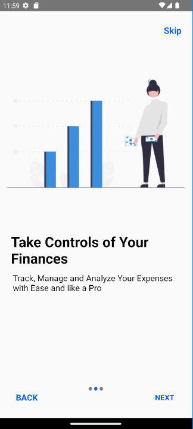
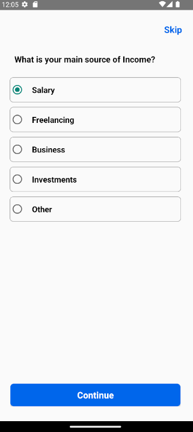

# Mini-Project-on-College-Activity

"Expense Tracker App" as a 3rd-year B. Engg.  mini project is a great choice that aligns with practical needs and modern app development. 
 Here's how you can approach it:

•	**Project Overview**

   The "Expense Tracker App" will help users manage their finances by tracking expenses and incomes.
   It offers automatic and manual entry options, integrates with UPI apps for real-time expense tracking, and ensures data security through authentication mechanisms.

•	**Objectives**

1.	**Financial Management:** Assist users in monitoring their spending habits and incomes to improve budgeting and financial planning.
2.	**Automatic Tracking:** Automatically log expenses using UPI transaction notifications, reducing manual data entry.
3.	**Manual Entry:** Allow users to manually input their expenses and incomes, especially for transactions not handled through UPI.
4.	**Data Security:** Implement secure authentication methods (e.g., OTP verification) to protect user data and prevent unauthorized access.

•	**Key Features**

1.	**UPI Integration:** Automatically track and update expenses when users make payments via UPI apps.{Under development}
2.	**Manual Entry:** Support for manual entry of transactions with categories like groceries, medical expenses, entertainment, etc.
3.	**Expense Analytics:** Provide users with visual analytics to understand their spending patterns over time.
4.	**Data Storage:** Store data securely using Firebase or other cloud-based solutions, ensuring it is accessible from any device.
5.	**Authentication:** Secure login with user credentials (name, mobile number, email, UPI ID, password) and OTP-based verification.

•	**Development Technologies**

1.	**Frontend:** Android Studio for app development using Java.
2.	**Backend:** Java for backend logic, Firebase for database and authentication.
3.	**APIs:** Integration with UPI apps for transaction tracking.
4.	**Security:** Implement secure data handling and encryption techniques.

•	**Steps to Achieve the Project**

1. **Requirement Analysis:** Gather and finalize all functional and non-functional requirements.
2. **Design:** Create wireframes and UI/UX designs for the app.
3. **Development:**
   i) Set up the project in Android Studio.
   ii) Develop the frontend with the necessary screens and fragments.
   iii) Implement backend logic using Java.
   iv) Integrate with UPI APIs and Firebase.
4. **Testing:** Conduct unit, integration, and user acceptance testing.
5. **Documentation:** Prepare a comprehensive report covering the design, implementation, testing, and conclusions.

•	**Expected Outcomes**

1.	A fully functional "Expense Tracker App" that effectively helps users manage their finances.
2.	Practical experience in app development, API integration, and data security.
3.	A stepping stone towards more advanced financial management tools and app development projects.

This project not only addresses a real-world problem but also offers valuable experience in various aspects of software development, 
 making it a solid choice for your mini-project.

Some Outputs:
 
**1. Splash Screen with Loader.**   
 

**2. Onboarding Sliders.**  

**3. SignUp Screen (Account Creation).**  
    

**4. Login Screen.**  
    

**5. User Insights collection.**  
   
   
   

**6. Home Screen (Dashboard).**  
    

**7. Add Transaction entry.**  
    